# <code>&nbsp;Rishikesh&nbsp;Sarangi&nbsp;</code>

### Backend &amp; Systems Software Engineer · B.Tech CSE '26

<table>
  <tr>
    <td valign="top" align="center">
      <code>rishikesh@github ~ $ ./whoami.sh</code>
        
      
    </td>
    <td valign="top" align="center">
      <code>rishikesh@github ~ $ neofetch</code>
        
      
    </td>
  </tr>
</table>

<code>rishikesh@github ~ $ ./contributions.sh</code>
  

  

---

### <code>~/projects</code>

- **Relational Database Engine** — a relational DB built end-to-end from scratch: storage engine, B-tree indexing, SQL query parser, and execution layer.
- **[Veilo](https://github.com/Rishicreates20/private-search-buddy)** — a privacy-focused hybrid search engine fusing BM25 keyword retrieval (SQLite FTS5) with dense semantic search via a custom Reciprocal Rank Fusion layer; async crawler behind a FastAPI backend.
- **Redis Clone (Java)** — an in-memory key-value store modelled on Redis: core data structures, command handling, and TTL-based expiry.
- **SafeSteel AI** — an LLM evaluation &amp; red-teaming framework; automated adversarial testing across 500+ prompts spanning 6 failure categories, cutting measured violation rate by 61%.

The heatmap above refreshes itself every day via GitHub Actions — no third-party image services, just self-hosted animated SVG.

